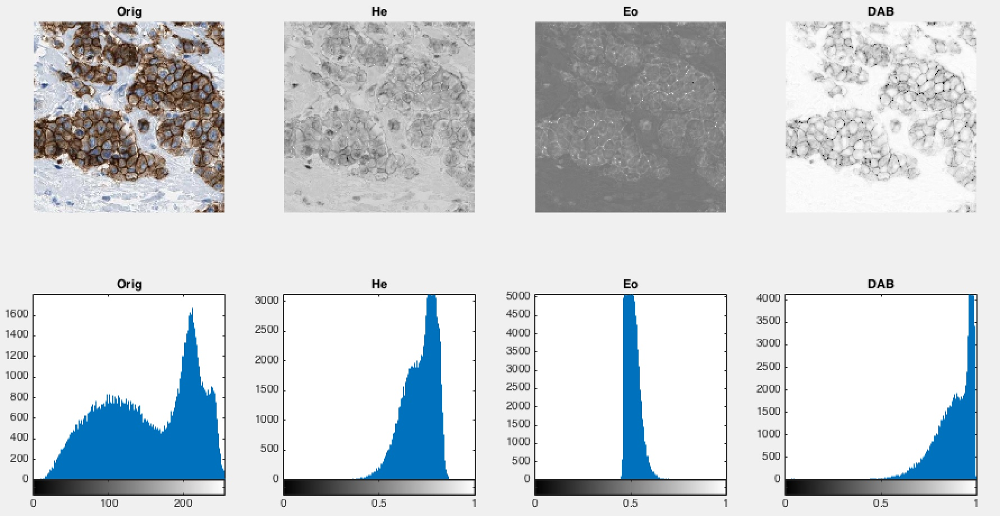

# Color deconvolution in MATLAB

## Background

Color deconvolution was introduced by Ruifrok et al. in 2001 [1] and describes a method to extract stain intensities from RGB images of histological slides. Color deconvolution is widely used for image processing in histology and there are very efficient Fiji and Python implementation available (see below, [2]). This repository provides an efficient Matlab implementation of color deconvolution. 

## Example

### Original image

Image source: www.proteinatlas.org [3]

### Fiji Output

Panels: Original - Stain vectors - Hematoxylin - DAB - residual

The source image is stained with Hematoxylin and DAB. The third channel represents the residual and should be empty. Here, this residual channel still contains a lot of information which is not desirable. For an optimal result, the standard values of the vectors have to be changed. Still, the DAB stain is extracted quite well.

### Output of my code

The output is similar to Fiji's output. The residual is not neglectable, but the DAB channel comes out quite well. Still, the stain vectors should be optimized.

## More resources on color deconvolution

* Fiji implementation explained on the [Fiji website](http://fiji.sc/Colour_Deconvolution)
* python scikit-image implementation on [GitHub](https://github.com/scikit-image/scikit-image/blob/master/skimage/color/colorconv.py)
* in-depth explanation of the fiji implementation on [mecourse.com](http://www.mecourse.com/landinig/software/cdeconv/cdeconv.html)
* another Matlab implementation by Antony Chan on [web.hku.hk](http://web.hku.hk/~ccsigma/color-deconv/color-deconv.html) (slower because of two nested for loops)
* yet another Matlab implementation: [imagenebula](https://code.google.com/p/imagenebula/source/browse/imagenebula/matlab/color/colordeconv.m?r=ec8fb69176f28ba49b38d5556452c38f7e02fa5a)

## References

[1] Ruifrok AC, Johnston DA. Quantification of histochemical staining by color deconvolution. Anal Quant Cytol Histol. 2001 Aug;23(4) 291-299. PubMed PMID: 11531144.

[2] van der Walt S, Schönberger JL, Nunez-Iglesias J, Boulogne F, Warner JD, Yager N, Gouillart E, Yu T, scikit-image contributors. scikit-image: image processing in Python. PeerJ. 2014;2 e453. doi:10.7717/peerj.453. PubMed PMID: 25024921; PubMed Central PMCID: PMC4081273.

[3] Pontén F, Jirström K, Uhlen M. The Human Protein Atlas--a tool for pathology. J Pathol. 2008 Dec;216(4) 387-393. doi:10.1002/path.2440. PubMed PMID: 18853439.
